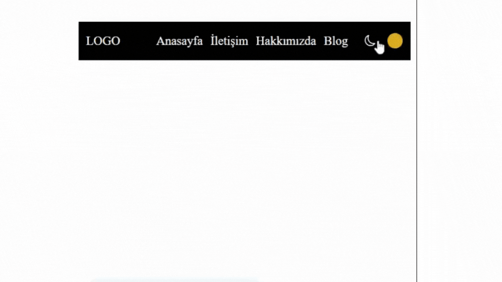

<h1>Toggle</h1>

Proje; JS kullanmadan sadece HTML ve CSS ile yapılmış, gece ve gündüz moduna geçebileceğiniz basit bir navbar toggle tasarımıdır. 

<h2> Kullanılan Teknolojiler </h2>
<ul>
<li>HTML</li>
<li>CSS</li>
</ul>

<h2>Ekran Görüntüsü</h2>

